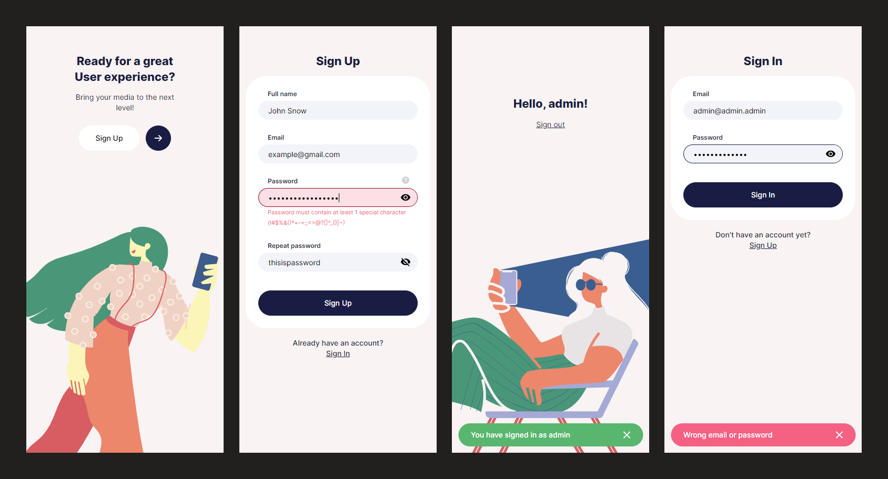

# Vue.js Job Test Assignment
This is a mobile website that I made as a job test assignment.
- Vue, VueX, Vue-Router, v-tooltip, HTML, SCSS
- 4 pages: EnterPage, SignUpPage, SignInPage, MainPage
- Form validation with error messsages
- Notifications
- JWT authorization (Fake backend)
- Animations
- Design from figma document  

This was my first time working with Vue and I really liked it! It seems like the vue developers looked at React/Redux and did the same thing, but more convenient and just better. Animations/transitions, scoped css/scss out of the box, prop-types, directives that greatly simplify templates, computed properties, watch, slots, etc. There is so much cool stuff in Vue and it just works!
I especially like VueX, it is so much more convenient to work with it than with Redux.  
 
https://svsem.github.io/VueTestAssignment/
 

